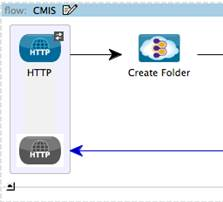
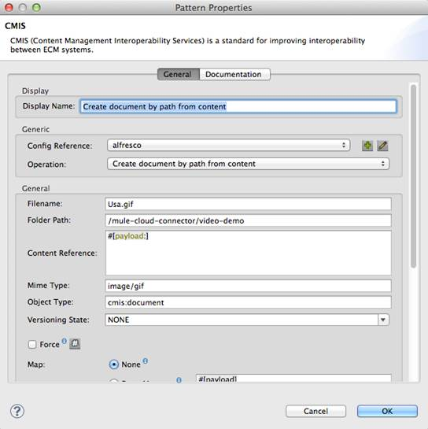
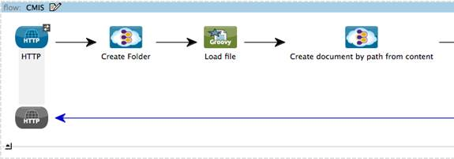

[Purpose](#purpose)     
[Prerequisites](#prerequisites)     
[Initial setup of the Mule project](#initial-setup-of-the-mule-project)     
    [Step 1: Install the CMIS connector from update site](#step-1-install-the-cmis-connector-from-update-site)      
    [Step 2: Create a new Mule project](#step-2-create-a-new-mule-project)      
    [Step 3: Store the credentials](#step-3-store-the-credentials)      
    [Step 4: Create a CMIS global element](#step-4-create-a-global-element)     
[Building the demo](#building-the-demo)     
    [Key Concepts Covered](#key-concepts-covered)   
    [Step 1: Configure the HTTP Endpoint](#configure-the-http-endpoint)     
    [Step 2: Configure the CMIS Connector](#configure-the-cmis-connector)       
    [Step 3: Add Groovy component](#add-grovvy-component)       
    [Step 4: Use the connector operation - Create Document By Path](#use-the-connector-operation-create-document-by-path)       
    [Step 5: Add the Object to JSON Transformer](#add-the-object-to-json-transformer)       
    [Step 6: Run the project](#run-the-project)     
[Resources](#resources)
    
Purpose
=======

This document provides detailed instructions on how to configure the connector in a Mule project and how to incrementally build a "" use case through the connector operations.

Prerequisites
=============

In order to build and run this project you'll need:  
●   [Public Alfresco CMIS Test Server](#http://cmis.alfresco.com/service/cmis-browser-app/connections)  
●   To download and install [Anypoint Studio Community edition](http://www.mulesoft.org/download-mule-esb-community-edition).  
●   A browser to make a request to your Mule application.  
 
Initial setup of the Mule project
=================================

### Step 1: Install the CMIS Connector from the update site
To begin building this application, start Anypoint Studio and  
1.      Go to **Help \> Install New Software**. From the Work with dropdown select **Anypoint Connectors Update Site.**  
2.      Expand the community Option and look for the **CMIS Connector.**  
3.      Check its checkbox and click **Next**. Complete the installation process. After the connector is installed you'll be required to restart Anypoint Studio.

### Step 2: Create a new Mule project
Once Anypoint Studio has launched, create a new project:  
1.      Go to **File \> New \> Mule Project**  
2.      In the New Mule Project configuration menu, provide a name for this project: **cmis-demo**  
3.      Click **Finish**.  

### Step 3: Store the credentials
In src/main/app/mule-app.properties file that's on your project, update key/values with your credentials.  

mule.cmis.username=
mule.cmis.password=
mule.cmis.url=
mule.cmis.repositoryId=
mule.cmis.endpoint=

### Step 4: Create a CMIS global element
1.      Click on "Global Elements" tab.  
2.      Click on "Create" to bring up Global Type dialog box.  
3.      Filter by "CMIS".  
4.      Select "CMIS" from "Connector Configuration" section.  
5.      Populate the fields with property placeholders.  

${mule.cmis.username}  
${mule.cmis.password}  
${mule.cmis.url}    
${mule.cmis.repositoryId}   
${mule.cmis.endpoint}   

6.      Click Ok.

Building the demo
=================
This tutorial introduces you to the CMIS connector, and shows you how to configure it to access your repository. The tutorial also discusses payloads and shows you how to use expressions, using the Mule Expression Language, to modify and view messages at various points in the project flow.

### Key Concepts Covered:

<table>
<tr>
<th>Component</th>
<th>Description</th>
</tr>
<tr>
<td> CMIS </td>
<td>To demonstrate how cloud connectors simplify API integration, this project uses the CMIS cloud connector to access a repository and upload a file.</td>
</tr>
<tr>
<td> HTTP </td>
<td>HTTP Endpoint to send and receive requests over HTTP transport protocol.</td>
</tr>
<tr>
<td> Object to Json </td>
<td>The Object to JSON Transformer converts a Java object to a JSON encoded object that can be consumed by other languages, such as JavaScript or Ruby.
</td>
</tr>
<tr>
<td> Groovy </td>
<td>The Groovy Component defines a script component backed by a Groovy script engine.
</td>
</tr>
</table>

A new project opens with a blank canvas for building the flow, and the Palette with Message Processors to the right.

**Step 1: Configure the HTTP Endpoint**

The first component (also called a message processor) in the flow is a HTTP Endpoint. This Endpoint will launch a web page at the URL you choose when deploying the project.

1. Locate the **HTTP** component in the **Endpoints** category of the Palette. Drag and place it on the canvas. Since you are placing the first component on the canvas, Anypoint Studio will create a containing-box around it, and label it "**cmis-demo**". As you add additional components to the flow, you will want to place them inside this same containing box.  

2. Open the HTTP Endpoint configuration menu. To do so, double-click on the component you just placed on the canvas, or choose "Properties" from its context menu.
3. Leave the default Port (**8081**) and Host (**localhost**).
4.  Enter **cmis** in the Path field.
5.  Click **OK** to close the configuration menu.

**Step 2: Configure the CMIS Connector**

1. Locate the **CMIS** message processor in the **Connectors** category of the Palette. Drag and place it on the canvas to the right of the HTTP Endpoint.  

2. Double-click on the CMIS connector in your flow to open its properties menu.
3. Note an error stating that "config-ref" is required, and an "x" next to the Config Reference form field. Click on the "+" icon next to this form field to create a "CMIS Global Element" or use the global element created above.
4. A **Global Element** properties menu opens. Fill username, password, and Base Url. For this example you can use the Alfresco repository located at Base Url: http://cmis.alfresco.com:80/cmisatom for which the username and password are both: "admin". Select the Endpoint as ATOM. 
Note:  
A *Global Element*allows to enter configuration information, such as your API credentials, once. You can then reference the Global Element many times within your flow (although for this project we only need to reference it once). Note the Global Elements tab under the Anypoint Studio canvas; this tab provides an alternative view for managing all Global Elements defined for this project.

5. The CMIS Properties menu should still be open. Notice that the Config Reference field has been updated to point to the new "CMIS" Global Element.
6. Select **Get or Create folder by path** from the Operation drop-down field.
7. Enter */mule-demo* in the Folder Path.
8. Click **OK** to close the CMIS Properties menu.

The CMIS connector configuration is complete. The red "x" next to its icon in the flow should no longer be present.             

               

**Step 3: Add Groovy Component**

1. Locate the **Groovy** component in the **Components** category of the Palette. Drag and place it on the canvas to the right of the expression component.  
2. Double-click on the **Groovy** component to open its properties menu.  
3. Change the Display Name to **Load file.**  
4. Enter this in the Script Text field:

        import java.io.FileInputStream;
    
        return new FileInputStream("/Users/../../image.gif");
Note: This file path with need to be changed to point correctly point to a GIF on your local system.

5. Click **OK** to close the Groovy component Properties menu.  

**Step 4: Use the connector operation - Create Document By Path**

Insert another CMIS connector after the Groovy script component and configure it to Create document by path from content: the configuration should look like this except that **Versioning State** should be set to *MAJOR* rather than *NONE* and the **Filename** field will need to be set to the name of whatever file you are using:

When finished, the flow should look like this:

  

**Step 5: Add the Object to JSON Transformer**

In this project, we will add an Object to JSON Transformer to the flow. In doing so, we will be able to view the response payload produced by CMIS in the browser.

1. Locate **Object to JSON** in the **Transformer** category of the Palette.  
2. Drag and place it on the canvas to the right of the last operation.

**Step 6: Run the project**

You are now ready to run the project! First, you need to run the flow form Studio, then open your favorite browser and type [http://localhost:8081/cmis](http://localhost:8081/cmis) and finally see the results.

Resources
=========

For additional information related to the CMIS Connector you can check the [API docs](http://mulesoft.github.io/cmis-connector/mule/modules.html).

Here's a list of features used in this demo with a link to their documentation

●   [Mule Expression Language](http://www.mulesoft.org/documentation/display/current/Mule+Expression+Language+MEL)  
●   [Configuring Endpoints](http://www.mulesoft.org/documentation/display/current/Configuring+Endpoints)  
●   [Studio transformers](http://www.mulesoft.org/documentation/display/current/Studio+Transformers)  
●   [Public Alfresco CMIS Test Server](#http://www.alfresco.com/cmis)

Webinars and additional documentation related to Mule ESB can be found under [Resources](http://www.mulesoft.com/resources) menu option.